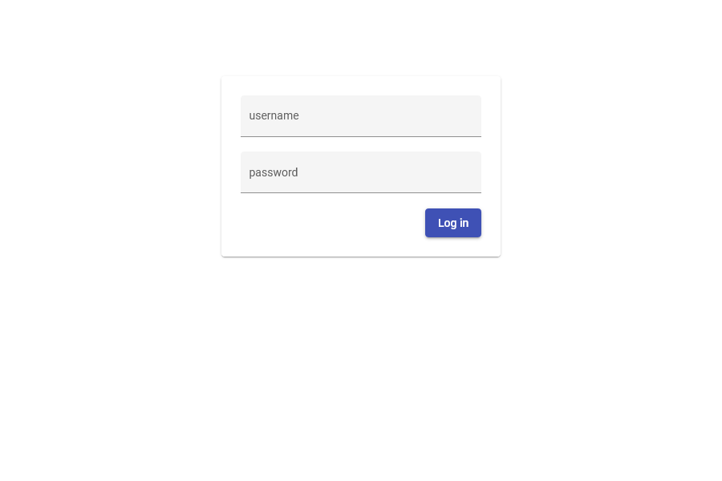

# *Integration Architectures* 

## Launching the Applications

For both front- and backend there ar run scripts included in their `package.json`.
So you can just start them by running `npm run start` in their respective directories. On Windows systems you should  start
the _backend_ with `npm run start_win`, because there environment variables are handled a little different than in Unix.

After they are done starting, the frontend can be reached from your browser at: http://localhost:4200/

